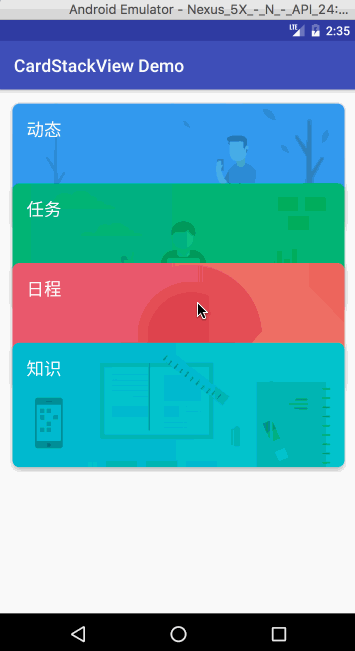

# CardStackView

[](https://jitpack.io/#brucezz/CardStackView)



## Installation

**Step 1.** Add the JitPack repository to your build file

Add it in your root build.gradle at the end of repositories:

```groovy
	allprojects {
		repositories {
			...
			maven { url "https://jitpack.io" }
		}
	}
```

**Step 2.** Add the dependency

```groovy
	dependencies {
	        compile 'com.github.brucezz:CardStackView:1.2'
	}
```
